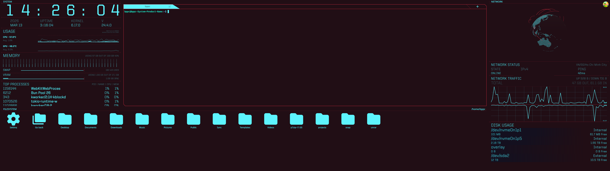

# eDEX-UI

A sci-fi fullscreen terminal emulator and system monitor, rebuilt with modern tech for daily use.


*DAEMON theme on 32:9 ultrawide (5120x1440)*

## Credits

This project stands on the shoulders of two great projects:

- **[GitSquared/edex-ui](https://github.com/GitSquared/edex-ui)** — the original eDEX-UI. A stunning sci-fi terminal that inspired everything here. Built with Electron, now archived.
- **[zluo01/edex-ui](https://github.com/zluo01/edex-ui)** — the Tauri v2 rewrite that gave this project its foundation. Replaced Electron with Tauri for dramatically better performance (~30MB RAM vs 200-300MB), rewrote the frontend in SolidJS, and modernized the entire stack.

This fork adds ultrawide support, new themes, terminal QoL features, and visual polish on top of zluo01's excellent rewrite.

## What's Different

**Layout**
- Adapted for 32:9 ultrawide monitors (works on 16:9 too)
- Responsive side panels — `16vw` on standard screens, `20vw` on ultrawides

**Themes**
- 6 built-in themes: TRON, APOLLO, BLADE, CYBORG, INTERSTELLAR, DAEMON
- **DAEMON** — Cyberpunk 2077-inspired dual-color scheme (red structure, cyan data)

**Terminal**
- Font zoom (Ctrl+/Ctrl-)
- Copy on select
- CWD in tab titles
- Clickable file paths (Ctrl+Click)
- Activity indicator on background tabs
- Search (Ctrl+F) with theme-aware highlights
- Right-click context menu
- Command history popup (Ctrl+Shift+H)
- Bell flash notification
- Close confirmation for active processes
- Tab drag reorder
- Configurable scrollback (1K-50K lines)
- Inline images via SIXEL protocol

**Globe**
- 3D globe with hex polygon countries
- Live TCP connection arcs with pulsing endpoint rings
- Geolocated via ip-api.com batch API

**Visual Polish**
- Boot animation with kernel log scroll and glitch title
- File browser icons colored by type (code, config, media, archive, etc.)
- Theme-derived color palette — all colors shift with the active theme

## Tech Stack

| Layer | Tech |
|-------|------|
| App framework | Tauri v2 (Rust backend + WebView frontend) |
| Frontend | SolidJS + TypeScript |
| Styling | Tailwind CSS v4 + augmented-ui |
| Terminal | xterm.js v6 + WebGL renderer |
| PTY | portable-pty (Rust) |
| System monitoring | sysinfo + nvml-wrapper (NVIDIA GPU) |
| Charts | SmoothieCharts |
| Globe | globe.gl (Three.js) |
| Build | Vite 7 |

## Build

### Prerequisites

- [Tauri v2 prerequisites](https://tauri.app/start/prerequisites/) (Rust, system deps)
- Node.js 22+ (Vite 7 requirement)
- pnpm

### Development

```bash
pnpm install
pnpm run dev
```

### Production Build

```bash
pnpm run build
```

### Lint & Format

```bash
pnpm run check      # biome lint + format
pnpm run type-check  # tsc --noEmit
```

## Known Limitations

- GPU monitoring requires NVIDIA (via NVML) — no AMD support yet
- Linux and macOS only (no Windows support)
- Requires a real terminal — this is not a web app

## License

GPLv3 — same as the original eDEX-UI.
